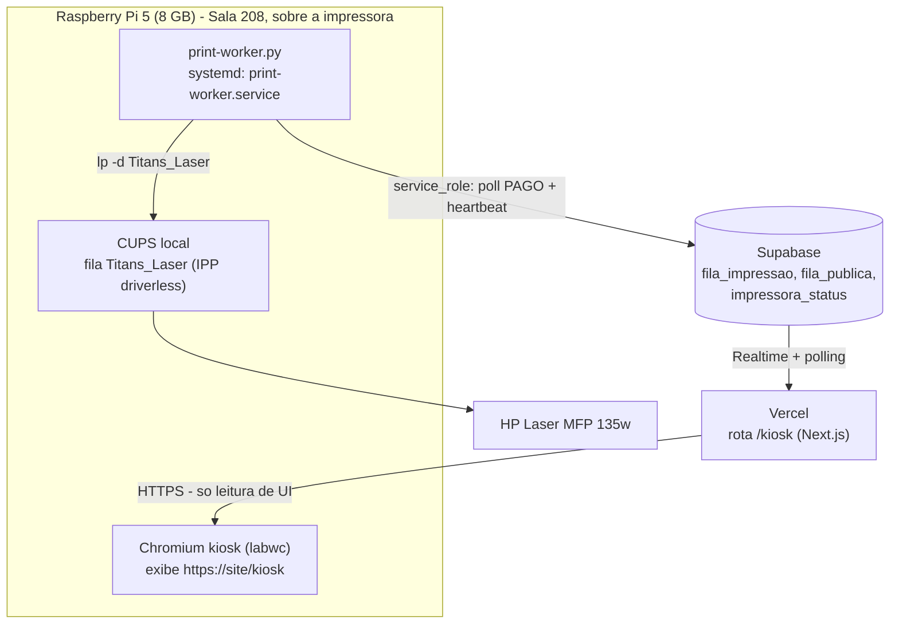

# 10 — Totem de impressão (kiosk) — Sala 208

[← Índice](README.md)

Guia de provisionamento da Raspberry Pi 5 que fica montada sobre a **HP Laser MFP 135w**
na Sala 208. Decisões relacionadas: **D1** (kiosk como rota do site, não app local) e
**D7** (provisionamento documentado, não automatizado) do
[design de `add-kiosk-client-view`](../../openspec/changes/add-kiosk-client-view/design.md).
Este documento é manual — não há Ansible nem imagem pronta; é o `git push` da UI +
estes passos na Pi.

## Visão geral

A Pi acumula **dois papéis independentes** na mesma máquina: exibe a UI do kiosk (que
vive na Vercel, a Pi só renderiza) e roda o worker que efetivamente imprime.



> A Pi **nunca** hospeda a página do kiosk — ela só é um monitor "burro" apontado para a
> Vercel (decisão D1). O worker é o único processo que fala com a impressora e com o
> Supabase usando a `service_role`.

| Papel | Processo | Onde roda | Depende de |
| --- | --- | --- | --- |
| Exibição do kiosk | Chromium `--kiosk` | Sessão gráfica (labwc), usuário autologin | Rede até a Vercel |
| Impressão | `print-worker.py` | `systemd` de sistema (`print-worker.service`) | CUPS local + Supabase |

## Faixa de status da impressora (o que o totem mostra)

A faixa no topo do kiosk (`FaixaImpressora`, em
`src/components/kiosk/FaixaImpressora.tsx`) lê a linha publicada pelo worker em
`impressora_status` via Realtime e traduz `estado` + `detalhes` em texto e cor. A
origem desses dados é o próprio `print-worker`: a cada heartbeat ele roda `ipptool`
contra a fila IPP (`printer-state-reasons`, `marker-levels`) além do health-check de
fila já existente — ver a seção "Heartbeat e saúde da impressora" em
[`print-worker/README.md`](../../print-worker/README.md) para os detalhes da coleta.

| Estado (`impressora_status.estado`) | Mensagem na faixa | Cor |
| --- | --- | --- |
| `OK` | "Impressora pronta" | verde |
| `IMPRIMINDO` | "Imprimindo…" | laranja (destaque Titans) |
| `PAUSADA` | "Impressora pausada" | âmbar |
| `SEM_PAPEL` | "Sem papel — a equipe já foi avisada" | âmbar |
| `SEM_TONER` | "Toner esgotado — a equipe já foi avisada" | vermelho |
| `MANUTENCAO` | "Impressora em manutenção — a equipe já foi avisada" | âmbar |
| `INALCANCAVEL` | "Impressora indisponível — equipe avisada" | vermelho |
| heartbeat velho (`offline`) | "Sistema de impressão offline" | vermelho — prioridade máxima, sobrepõe qualquer `estado` |

Além da faixa principal, um selo discreto **"Toner acabando · N%"** (âmbar) aparece
sempre que `detalhes.toner_baixo` for `true` — independente do estado (mesmo com a
impressora `OK`/`IMPRIMINDO`), porque toner baixo é só aviso: a impressora continua
aceitando e concluindo trabalhos normalmente.

## Pré-requisitos

1. **Raspberry Pi OS (64-bit) com desktop, Bookworm ou mais recente.** Grave com o
   [Raspberry Pi Imager](https://www.raspberrypi.com/software/); nas opções avançadas
   (`Ctrl+Shift+X`) já defina hostname, Wi-Fi (se aplicável) e habilite SSH — facilita o
   provisionamento sem precisar de teclado/mouse na sala.
   ```bash
   sudo apt update && sudo apt full-upgrade -y
   sudo reboot
   ```
2. **Confirme que a sessão gráfica usa Wayland + labwc** (padrão em imagens Bookworm
   recentes; imagens mais antigas migradas por `apt upgrade` podem ter ficado no
   Wayfire):
   ```bash
   echo "$XDG_SESSION_TYPE"     # esperado: wayland
   echo "$WAYLAND_DISPLAY"      # esperado: algo como wayland-0
   ```
   Se não for `labwc`, troque em `sudo raspi-config` → **6 Advanced Options** → **A6
   Wayland** → `labwc` (ou `sudo apt install labwc` primeiro, se o pacote não estiver
   presente — imagens antigas atualizadas via `apt` às vezes não puxam o pacote
   automaticamente).
3. **Login automático na área de trabalho** (a Pi precisa "subir sozinha" numa sessão
   gráfica após queda de energia, sem alguém digitar senha):
   ```bash
   sudo raspi-config nonint do_boot_behaviour B4   # B4 = Desktop Autologin
   ```
4. **Rede estável.** O kiosk busca a página e os dados via Supabase/Vercel continuamente;
   prefira **cabo Ethernet** se houver ponto na Sala 208. Se for só Wi-Fi, confirme sinal
   bom no local exato onde a Pi fica montada (sobre a impressora, possivelmente perto de
   metal):
   ```bash
   ping -c 3 <dominio-do-site>
   ```
5. **CUPS com a fila `Titans_Laser` configurada.** Esta parte é a mesma coisa em qualquer
   máquina do worker — siga à risca o
   [`print-worker/README.md`](../../print-worker/README.md) (seção "Pré-requisitos"):
   instalar CUPS **sem HPLIP**, criar a fila IPP driverless pelo nome mDNS `.local`,
   opcionalmente a fila USB de fallback, e confirmar com um teste de impressão físico
   (`lp -d Titans_Laser /usr/share/cups/data/testprint`).
6. **Tela touch reconhecida.**
   ```bash
   wlr-randr                       # lista as saídas de vídeo ativas
   libinput list-devices | grep -A2 -i touch   # confirma o dispositivo de toque
   ```
7. **SSH habilitado** (`sudo raspi-config` → Interface Options → SSH), essencial para o
   troubleshooting remoto (seção final deste documento).

## Chromium em modo kiosk (Wayland/labwc)

```bash
sudo apt install chromium-browser
# em algumas imagens o binário chama apenas "chromium":
which chromium-browser || which chromium
```

Duas formas de autostart. **Recomendada: systemd user service**, porque a mesma unit
serve de autostart *e* de watchdog (seção seguinte). A alternativa (loop de shell no
autostart do labwc) funciona, mas perde a integração com `journalctl` e o
`Restart=always` estruturado.

### Opção A (recomendada) — systemd user service + labwc autostart como "cola"

O detalhe chato do Wayland: uma unit `systemd --user` não herda automaticamente
`WAYLAND_DISPLAY`/`XDG_RUNTIME_DIR` da sessão gráfica. A solução padrão é deixar o
**autostart do labwc** (que só roda depois que a sessão Wayland já existe) importar essas
variáveis para o gerenciador `systemd --user` e então iniciar a unit.

Crie a unit do Chromium:

```bash
mkdir -p ~/.config/systemd/user
nano ~/.config/systemd/user/chromium-kiosk.service
```

```ini
[Unit]
Description=Chromium em modo kiosk (totem de impressao - Sala 208)
After=graphical-session.target
Wants=graphical-session.target

[Service]
Type=simple
Environment=XDG_RUNTIME_DIR=%t
ExecStart=/usr/bin/chromium-browser \
  --kiosk \
  --noerrdialogs \
  --disable-infobars \
  --disable-session-crashed-bubble \
  --disable-pinch \
  --overscroll-history-navigation=0 \
  --check-for-update-interval=31536000 \
  --ozone-platform=wayland \
  https://<dominio-do-site>/kiosk
Restart=always
RestartSec=5

[Install]
WantedBy=default.target
```

> Ajuste `/usr/bin/chromium-browser` para o caminho real (`which chromium-browser`).
> `--disable-pinch` e `--overscroll-history-navigation=0` não foram pedidos no plano
> original, mas evitam que um gesto de toque dê zoom ou "volte a página" sem querer num
> totem público — mantenha-os. `--ozone-platform=wayland` força o Chromium a desenhar
> nativamente no Wayland (em vez de cair para XWayland).

Crie o autostart do labwc que importa o ambiente e sobe a unit:

```bash
mkdir -p ~/.config/labwc
nano ~/.config/labwc/autostart
```

```bash
#!/bin/sh
# Publica as variaveis da sessao Wayland para o gerenciador systemd --user.
# Sem isso, a unit chromium-kiosk.service nao acha o socket do labwc mesmo
# com WAYLAND_DISPLAY/XDG_RUNTIME_DIR "corretos" no ambiente do systemd.
systemctl --user import-environment WAYLAND_DISPLAY XDG_RUNTIME_DIR DISPLAY
dbus-update-activation-environment --systemd WAYLAND_DISPLAY XDG_RUNTIME_DIR DISPLAY 2>/dev/null

systemctl --user start chromium-kiosk.service
```

```bash
chmod +x ~/.config/labwc/autostart
systemctl --user daemon-reload
systemctl --user enable chromium-kiosk.service
sudo loginctl enable-linger "$USER"   # mantem o systemd --user vivo mesmo sem sessao ativa
```

Reinicie e confirme:
```bash
sudo reboot
# depois de logar via SSH:
systemctl --user status chromium-kiosk.service
journalctl --user -u chromium-kiosk -b
```

### Opção B — só labwc autostart (sem systemd --user)

Mais simples, mas sem logs estruturados nem `Restart=always` de verdade (usa um loop de
shell). Use só se quiser evitar `systemd --user` por algum motivo:

```bash
# ~/.config/labwc/autostart
#!/bin/sh
while true; do
  chromium-browser \
    --kiosk --noerrdialogs --disable-infobars --disable-session-crashed-bubble \
    --disable-pinch --overscroll-history-navigation=0 \
    --check-for-update-interval=31536000 --ozone-platform=wayland \
    https://<dominio-do-site>/kiosk
  sleep 2
done
```

## Desligar blanking e ocultar o cursor

### Screen blanking / DPMS

Caminho oficial (via `raspi-config`, que sabe lidar com o mecanismo específico do
labwc):

```bash
sudo raspi-config
# 2 Display Options -> D3 Screen Blanking -> No
```

Equivalente não interativo:
```bash
sudo raspi-config nonint do_blanking 1   # 1 = desabilita o blanking
sudo reboot
```

> **Quirk conhecido:** em imagens que já vieram do Wayfire e foram atualizadas para
> labwc, o ajuste de blanking às vezes só "pega" depois de um ciclo
> desabilitar → reboot → conferir (relatos na comunidade e issues abertas no próprio
> `labwc` sobre a tela não voltar do blanking). Se a tela ainda apagar sozinha depois
> do passo acima, use o reforço abaixo.

**Reforço com `wlopm`** (Wayland output power management — força as saídas a ficarem
ligadas). Confirme que está instalado e liste as saídas:
```bash
which wlopm || sudo apt install wlopm
wlopm                # lista saidas e estado de energia, ex.: DPI-1 on
```

Adicione ao `~/.config/labwc/autostart` (antes de subir o Chromium):
```bash
wlopm --on '*' 2>/dev/null
```

Como o blanking do labwc é um ponto historicamente instável, vale um reforço periódico
via timer do `systemd --user`:

```bash
nano ~/.config/systemd/user/wlopm-keepalive.service
```
```ini
[Unit]
Description=Forca as saidas de video a permanecerem ligadas (reforco anti-blanking)

[Service]
Type=oneshot
ExecStart=/usr/bin/wlopm --on '*'
```
```bash
nano ~/.config/systemd/user/wlopm-keepalive.timer
```
```ini
[Unit]
Description=Executa wlopm-keepalive a cada 5 minutos

[Timer]
OnBootSec=1min
OnUnitActiveSec=5min

[Install]
WantedBy=timers.target
```
```bash
systemctl --user daemon-reload
systemctl --user enable --now wlopm-keepalive.timer
```

### Ocultar o cursor

A tela é **touch**, então normalmente não há cursor visível em produção (o cursor só
aparece se um mouse USB estiver conectado). O Chromium em `--kiosk`/tela cheia já
auto-oculta o cursor sobre o conteúdo após alguns segundos sem movimento — geralmente
suficiente. Se um mouse ficar conectado por conveniência durante a instalação, **remova-o
antes de deixar o totem em produção**. `unclutter`/`unclutter-xfixes` é uma opção só de
X11 e não tem garantia de funcionar sobre o Chromium nativo em Wayland — trate como
tentativa de último caso, e valide visualmente antes de confiar nele.

## Watchdog (recuperação automática)

A unit `chromium-kiosk.service` (Opção A) já tem o watchdog embutido:

```ini
Restart=always
RestartSec=5
```

Isso cobre o Chromium travar, ser morto por falta de memória (improvável nos 8 GB, mas
possível) ou fechar por qualquer motivo — ele sobe de novo sozinho em 5 segundos, sem
qualquer intervenção.

**Depois de uma queda de energia**, a sequência de recuperação é toda automática:

1. A Pi liga e o firmware sobe o Raspberry Pi OS normalmente.
2. Login automático na área de trabalho entra na sessão labwc (pré-requisito 3).
3. O autostart do labwc importa o ambiente Wayland e inicia `chromium-kiosk.service` —
   o kiosk reaparece na tela.
4. Em paralelo, `print-worker.service` (unidade de **sistema**, independente da sessão
   gráfica) já sobe no boot via `multi-user.target` e retoma o polling da fila assim que
   a rede e o CUPS estiverem prontos (`After=network-online.target cups.service` no
   unit — ver [`print-worker.service`](../../print-worker/print-worker.service)).

Nenhum passo manual é necessário. Para testar de propósito:
```bash
sudo systemctl reboot
# depois de religar, via SSH:
systemctl --user status chromium-kiosk.service
sudo systemctl status print-worker
```

## Convivência com o print-worker.service

O worker (documentado em [06](06-print-worker.md) e [07](07-operacao.md)) já roda nessa
mesma Pi como serviço de **sistema**. Não há conflito com o kiosk:

- **Escopos diferentes de systemd** — `print-worker.service` é `WantedBy=multi-user.target`
  (sobe independente de sessão gráfica); `chromium-kiosk.service` é `systemd --user` da
  sessão do autologin. Um não derruba o outro; reiniciar um não afeta o outro.
- **Recursos independentes** — o worker fala com CUPS via `lp`/`lpstat` (CLI, custo
  baixíssimo de CPU) e com o Supabase via HTTPS; o Chromium usa a GPU para renderizar o
  kiosk. Na Pi 5 (8 GB) os dois convivem com folga.
- **Instale o worker normalmente**, seguindo [`print-worker/README.md`](../../print-worker/README.md):
  ```bash
  sudo cp -r print-worker /opt/print-worker
  cd /opt/print-worker
  python3 -m venv .venv
  .venv/bin/pip install -r requirements.txt
  cp .env.example .env && chmod 600 .env
  ```
  Preencha o `.env` com as três variáveis obrigatórias (sem elas o worker recusa subir):

  | Variável | Valor nesta Pi |
  | --- | --- |
  | `SUPABASE_URL` | URL do projeto Supabase |
  | `SUPABASE_SERVICE_ROLE_KEY` | service_role (segredo — `chmod 600`, nunca commitar) |
  | `PRINTER_NAME` | `Titans_Laser` (fila Wi-Fi/IPP driverless, ver `lpstat -p`) |

  ```bash
  sudo cp print-worker.service /etc/systemd/system/print-worker.service
  sudo nano /etc/systemd/system/print-worker.service   # ajuste User=
  sudo systemctl daemon-reload
  sudo systemctl enable --now print-worker
  ```
- **Só uma Pi rodando o worker.** Como já vale para qualquer instalação (ver "Worker
  fantasma" em [07](07-operacao.md)), não deixe um segundo worker esquecido em outra
  máquina — ele competiria pelos pedidos.

## Nota térmica (Raspberry Pi 5)

A Pi 5 consome e esquenta mais que gerações anteriores, e aqui ela roda **dois processos
pesados o tempo todo** (Chromium com aceleração de GPU renderizando animações do kiosk +
o worker) **montada em cima de uma impressora**, que também gera calor durante a
impressão. Use obrigatoriamente:

- O **Active Cooler** oficial (ventoinha + dissipador) ou, no mínimo, um case com
  dissipador passivo de bom fluxo de ar. Não deixe a Pi encostada diretamente no topo
  quente da impressora — garanta um espaçador/suporte com folga de ar.
- Fonte oficial USB-C de 27 W — fontes subdimensionadas causam undervoltage, que também
  aciona o throttling.

**Verifique throttling** periodicamente:
```bash
vcgencmd measure_temp
vcgencmd get_throttled
```
`get_throttled` retorna um bitmask: `0x0` é saudável. Qualquer bit ligado (ex.:
`0x50005`) indica throttling atual ou passado por temperatura e/ou undervoltage — se
aparecer, revise a refrigeração e a fonte antes de deixar o totem em produção sem
supervisão.

## Solução de problemas

**A tela apagou / ficou preta:**
1. Confira o ajuste de blanking (`sudo raspi-config` → Display Options → Screen
   Blanking) e force as saídas via `wlopm --on '*'` (seção acima).
2. Descarte causa térmica/elétrica: `vcgencmd get_throttled` — undervoltage some vezes
   se manifesta como tela caindo, não só performance.
3. Confira o cabo de vídeo/energia da tela touch.

**O Chromium aparece com barra de erro (ex.: "Restaurar páginas"):**
1. Confirme que a `ExecStart` da unit tem os quatro flags de supressão
   (`--noerrdialogs --disable-infobars --disable-session-crashed-bubble
   --check-for-update-interval=31536000`).
2. Se a barra de "sessão encerrada incorretamente" insistir mesmo com os flags (comum
   após queda de energia no meio de uma sessão, quando o perfil grava
   `"exit_type":"Crashed"`), normalize o perfil antes de cada início — adicione à unit:
   ```ini
   ExecStartPre=/bin/sh -c '\
     f=$(ls ~/.config/chromium-browser/Default/Preferences 2>/dev/null || \
         ls ~/.config/chromium/Default/Preferences 2>/dev/null); \
     [ -n "$f" ] && sed -i "s/\\"exit_type\\":\\"Crashed\\"/\\"exit_type\\":\\"Normal\\"/" "$f"; \
     exit 0'
   ```

**O kiosk não abre depois do boot (tela fica só no desktop do labwc):**
1. Confirme login automático ativo: `sudo raspi-config` → System Options → Boot / Auto
   Login → Desktop Autologin.
2. Confirme que o autostart rodou e importou o ambiente:
   ```bash
   journalctl --user -u chromium-kiosk -b
   systemctl --user show-environment | grep -i wayland
   ```
3. Confirme que a unit está habilitada: `systemctl --user is-enabled chromium-kiosk`.

**Acessar via SSH e reiniciar só o navegador (sem tocar no worker):**
```bash
ssh <usuario>@<ip-da-pi>
systemctl --user restart chromium-kiosk.service     # só o Chromium
journalctl --user -u chromium-kiosk -f              # logs do kiosk

# o worker é independente — reiniciar/checar sem afetar o kiosk:
sudo systemctl restart print-worker
journalctl -u print-worker -f
```
`loginctl enable-linger` (feito na Opção A) garante que `systemctl --user` funcione via
SSH mesmo sem uma sessão gráfica "ativa" do ponto de vista do `logind`.

---

Anterior: [09 — Diagramas](09-diagramas.md) · [↑ Índice](README.md)
